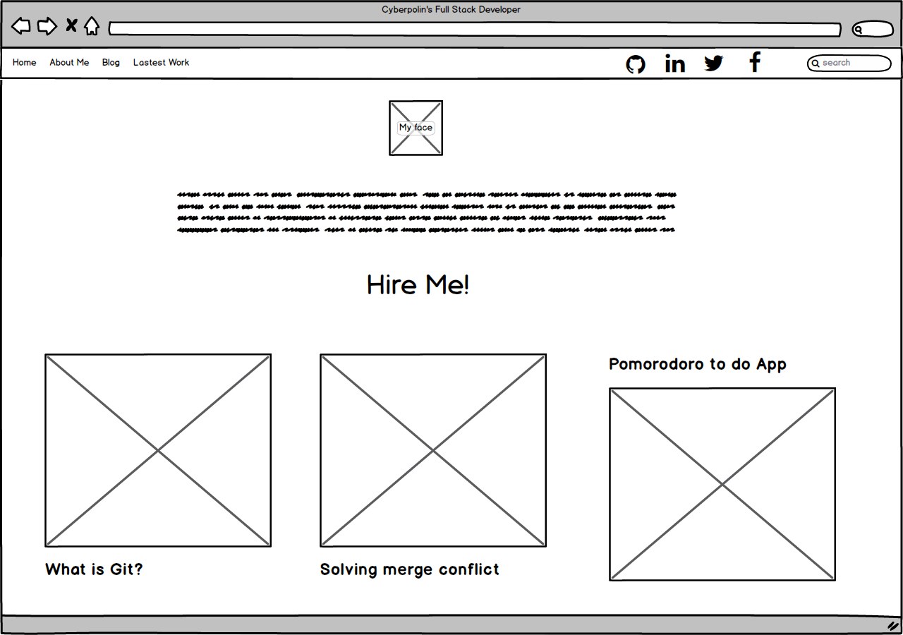

# 2.4 Wireframing

What is a wireframe?
- It is a graphical representation of a website zones or objects, and a way to plan the layout of a website or app.

What are the benefits of wireframing?
- Wireframing is a fast way to sketch the layout of your app or website, and a way for you and your peers, or even costumers get an idea of how the project will look, this help you to make changes before designing.

Did you enjoy wireframing your site?
- I did, it was cool to plan where to put the content, and it was pretty cool to prioritize the sections of my site, in that way i decide where to put what.

Did you revise your wireframe or stick with your first idea?
- I did iterate twice, because the first idea i had looked weird.

What questions did you ask during this challenge? What resources did you find to help you answer them?
- I didn't knew where to put the more important info on screen, A Beginner’s Guide to Wireframing help me alot.

Which parts of the challenge did you enjoy and which parts did you find tedious?
- The idea of iter a lot, i love that, the MVP concept applied to UX is super cool, and the more tedious part was the reading, there was a lot of info, though i love what i learn.

## Index Wireframe

## Blog Wireframe

