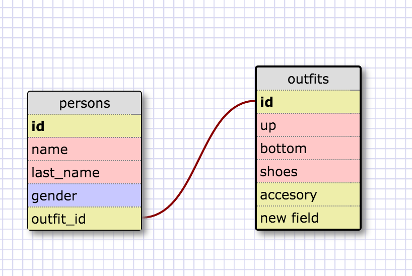

# Introduction to Databases

#### I worked on this challenge [by myself, with: ]
#### This challenge took me [1.5] hours.

## SQL Queries


1. Select all data for all states.
```SELECT * FROM states;```

2. Select all data for all regions.
```SELECT * FROM regions;```

3. Select the state_name and population for all states.
```SELECT state_name, population FROM states;```

4. Select the state_name and population for all states ordered by population. The state with the highest population should be at the top.
```SELECT state_name, population FROM states ORDER BY population DESC;```

5. Select the state_name for the states in region 7.
```SELECT state_name FROM states WHERE region_id = 7;```

6. Select the state_name and population_density for states with a population density over 50 ordered from least to most dense.
```SELECT state_name, population_density FROM states
   WHERE population_density > 50
   ORDER BY population_density  ASC;```

7. Select the state_name for states with a population between 1 million and 1.5 million people.
```SELECT state_name FROM states
   WHERE population_density BETWEEN 1 AND 1.5;```

8. Select the state_name and region_id for states ordered by region in ascending order.
```SELECT state_name, region_id FROM states
   ORDER BY region_ID ASC;```

9. Select the region_name for the regions with "Central" in the name.
```SELECT region_name FROM regions
   WHERE region_name LIKE "%Central%";```

10. Select the region_name and the state_name for all states and regions in ascending order by region_id. Refer to the region by name. (This will involve joining the tables).
```SELECT region_name, state_name FROM states
   JOIN regions ORDER BY region_id;```


## `persons` and `outfits` Schema


<!-- Include a link to your schema design here -->


## Reflection

- What are databases for?
  Saving persistence data in a more structured way than arrays or hashes.
- What is a one-to-many relationship?
  Is a relationship where one table can have many register of another, but not the other way arround.
- What is a primary key? What is a foreign key? How can you determine which is which?
  A primary key is a item that can not be repeated or NULL is something UNIQUE in that table, it can be used to match a foreign key.
  Foreign key is like a primary key but it can be repeated besides is a way to make reference to a item in other table, it refers the other table primary key.
- How can you select information out of a SQL database? What are some general guidelines for that?
  you first SELECT the table or tables you want to retreive, then FROM which DB, and then conditions like WHERE or the ORDER you want to present the info.