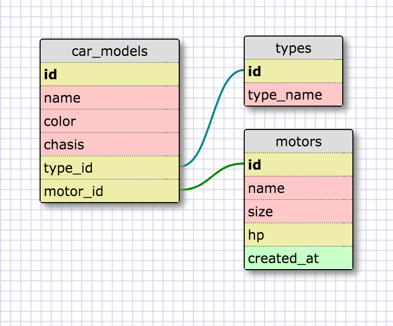
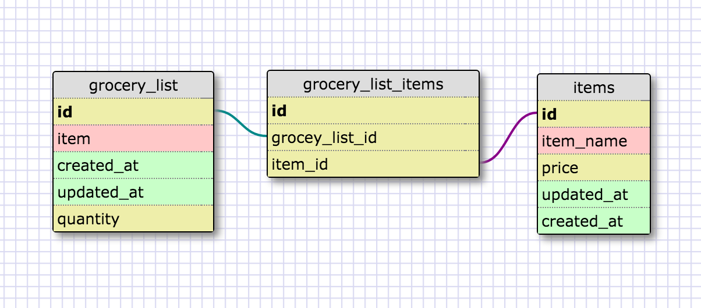

# 8.5 More Schemas

## Reflection

- What is a one-to-one database?
  Is a database where two tables have a item relation with a item in other table, but they can only a relation from item to item.

  

- When would you use a one-to-one database? (Think generally, not in terms of the example you created).
  When you have a comon item value between the posible items in the list, for example a zodiac sign for a person, they are only 12 zodiac sign, so it would be silly to write every single one on a lis of 12K users, stead of that whe can use the zodiac signs as a catalog, and stead of writing the hole name we only write the id of that table.

- What is a many-to-many database?
  That's when a table can have multiple items associated with other table.

  

- When would you use a many-to-many database? (Think generally, not in terms of the example you created).
  It's a little difficult to find a good example, but think in a startup and founders, a startup can have a lot of founders, the same way a founder can have many startups. :)

- What is confusing about database schemas? What makes sense?
  The join table idea is weird at the begining but once you get a grasp everything is ok.