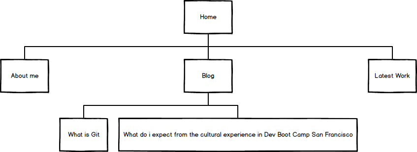

# My very first site map

#Now the relfection :)

**What are the 6 Phases of Web Design?**
- Information Gathering
  The most important part of all, if we get a good quality info, then we can plan, design, develop, deliver and mantainance.
  It's very important to explain to the costumer that a website is not for publishing all the info about a bussines, the key in this phase is to select especific information, this way you tell the final user what you want to, it also help him not to loose himself in a sea of information. A properly selection of the info, also help us as developers/designer on the next phases.

  Some important stuff to consider are:
    -Purpose
    -Goals
    -Audience
    -Content

- Planning
  In this fase we build the so famous sitemap which is the result of planing the site, while planing the site is importat to think what of the collected info goes first, or is more important to show.
  

- Design
  Now that we know the site structure we need a design, is important to design thinking about the target audience and that's called UX design, User Experience desing is a design aproach where the design is based on asumptions sabout how the user is going to use the site or aplication, with that in mind we will try to make as easy as posible.

- Development
  Were the magic happend, where the thinks get done. Just code youre site as you planed and designed.

- Testing and Delivery
  Here is where the costumer will make observations about the site, the developer team make some tests and get any posible mistake right.

- Maintenance
  Once the site is delivered, or finished we can or can't keep it up to date, in this phase we could get back to any other phase and improve our site, may be adjust target audience, which probably means whe need to make design or planing changes, etc...

**What is your site's primary goal or purpose? What kind of content will your site feature?**
- The main goal is to get a job or customer in USA, UK or Canada, so keeping that in mind, the site will feature my experience as a developer, so mi work would be very important, but at this stage i will put my blog as the most important feature. The two main reasons for that are: 1. I'll like to show my feature employee the learning process i'am in, and show my comunication skill. and 2. show as my work the lates practices i'm developing.

**What is your target audience's interests and how do you see your site addressing them?**
- As i'm thinking on start ups and or developers hubs, i imagine they are looking for self manage developers, creative and original minds, also good comunicator and emphatic developer.

**What is the primary "action" the user should take when coming to your site? Do you want them to search for information, contact you, or see your portfolio? It's ok to have several actions at once, or different actions for different kinds of visitors.**
-In general i will list then in importance order:
  1. See who i am
  2. Read the more important posts on my site
  3. Contact me
  4. See my lates work

**What are the main things someone should know about design and user experience?**
- Just to think who you want to adress the site to, basing your design in that will improve the UX

**What is user experience design and why is it valuable?**
- Is a group of thecniques that try to make a site easy to use and to understand, it also try to persuade the user to take certain action.

**Which parts of the challenge did you find tedious?**
- The reading, it is a lot of information, and i got lost, also i think it is dificult to order all that info.

